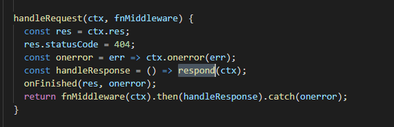
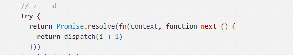

## koa

# 这里是 http.creatserver 的callback，通过creatcontext  把req res 包装成为 ctx，然后返回handleRequest

# 这里是把所有use的中间件对ctx进行处理，基本使用的app.use(ctx=>{})就是一层中间件，对req和res进行业务处理，每次新的请求过来都会执行一遍，respond是对返回数据的进一步处理，如没有返回数据，对数据进行JSON序列化等，

# 这里就是大名鼎鼎的洋葱模型，递归使用中间件对ctx对象进行处理，，封装
